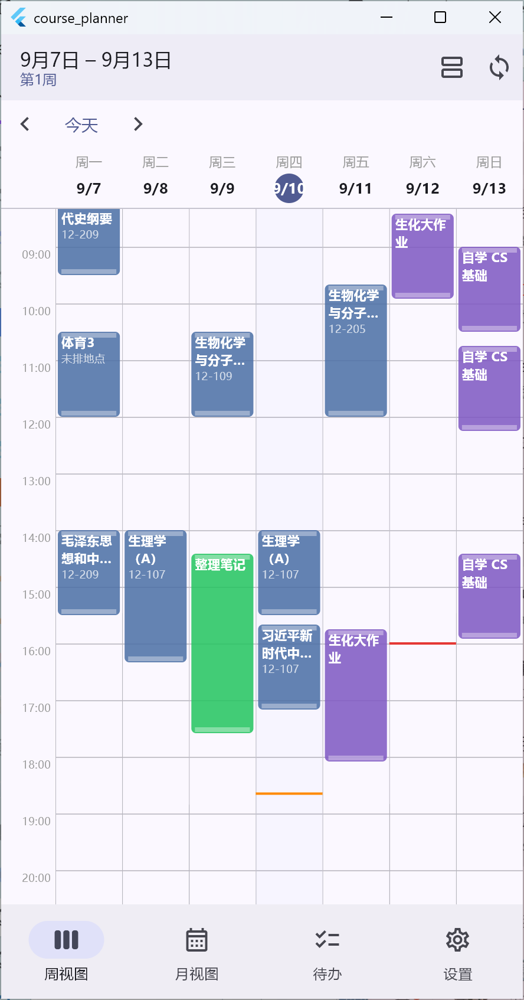
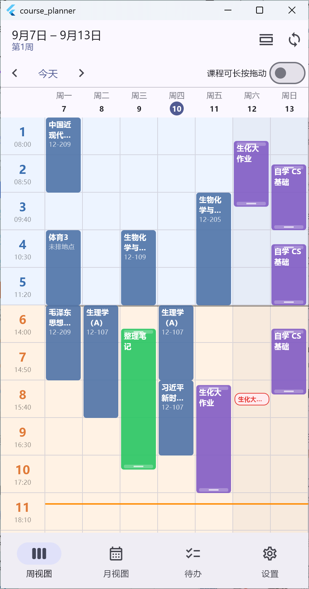
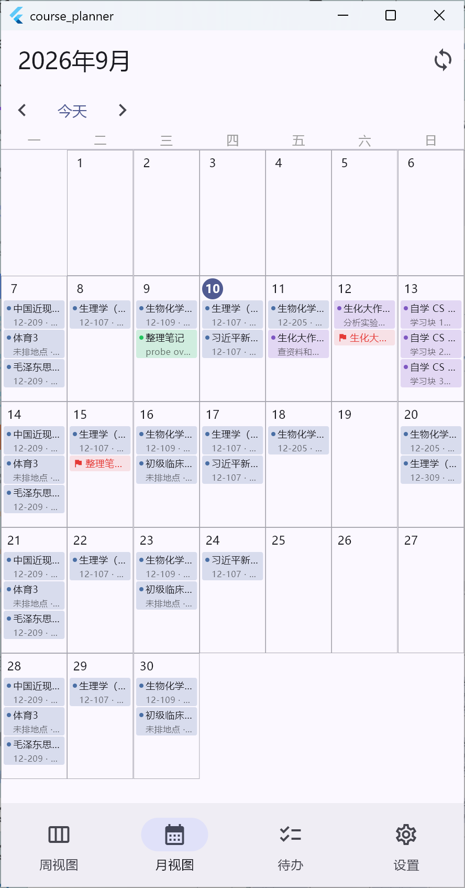
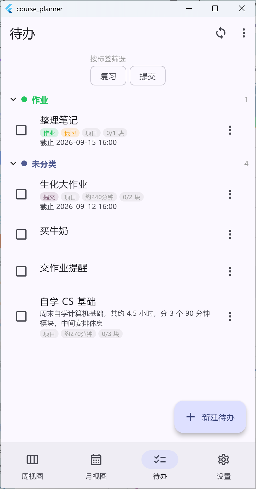

# Course Planner

课程表 / 日程 / Todo 工具，带离线同步和 MCP。Go + PostgreSQL 后端，Next.js 网页端，Flutter 客户端（Windows / Android）。

打开就能用：

| | 地址 |
| --- | --- |
| 网页版 | <https://course-planner.lendwishes.moe> |
| 后端 API | <https://course.lendwishes.moe> |

Android 装 Releases 里的 APK，登录页服务器地址填 `https://course.lendwishes.moe`（不带路径会自动补 `/api/v1`）。

## 截图

| 时间轴周视图 | 课表视图 |
| --- | --- |
|  |  |

| 月视图 | 待办 |
| --- | --- |
|  |  |

## 功能

周视图两种形态，一键切换且状态会记住：

- 时间轴：7×24 网格，拖动/缩放时间块，当前时间橙线，截止时间红线
- 课表：横为星期、竖为节次，按学期节次模板裁剪事件，上下午双色分区

标题显示日期范围和周次，不在学期内会写「不在本学期」。左右滑动切换周，点标题跳转到指定日期。手机上滑动滚动，长按色块移动或缩放。中午分界点可配置（默认 12:00），课表和月视图的行高都能调。

学期与节次：一个学期 = 第一周周一 + 总周数 + 节次模板。添加节次时编号自动顺延，开始时间默认取上一节下课加 10 分钟。课表用哪个学期在「设置 → 学期管理」里选。

Todo 分一次性（临时活动、会议、购物清单，最多 1 个时间块、无截止时间）和项目（可拆多个时间块、可设截止时间）。时间块带备注和状态。分类折叠分组，标签多选筛选，新建待办时可直接建分类和标签。课程颜色可选，时间块跟随所属分类的颜色。

离线优先：改动先写本地 SQLite 并立刻上屏，联网后按 pull → push → pull 自动同步。冲突按字段对比「本次修改 vs 服务器」并说明实体来源，逐条决定保留哪边。

多服务器：登录时填地址，设置里可切换，切换时选云端覆盖本地或本地覆盖云端，各服务器凭据分开保存。

备份：导出全部本地数据和登录凭据为 JSON；导入时按类别勾选，导入前自动先导出一份当前数据。

## MCP

服务端内置 MCP，Agent 可以直接读写课表和待办。

端点 `<backend>/api/v1/mcp`，Streamable HTTP，客户端 transport 选 `http`（不是 `sse`）。24 个工具：读取类直接调用，写入类走 `preview_changes` 生成 ChangeSet，再用 `apply_changes` 一次性提交，整批一个事务。

| 类别 | 工具 |
| --- | --- |
| 读取 | `get_current_time` `get_user_timezone` `get_calendar` `get_courses` `get_schedule` `get_todos` `get_todo` `get_free_slots` `search_todos` `search_courses` |
| 待办 | `create_todo` `update_todo` `delete_todo` `create_todo_block` `update_todo_block` `delete_todo_block` |
| 课程 / 周期 | `create_course` `update_course` `delete_course` `create_recurring_schedule` `update_recurring_schedule` `delete_recurring_schedule` |
| 确认 | `preview_changes` `apply_changes` |

拿 token 两种方式：App 里「设置 → 连接到 MCP → 一键获取」，或浏览器打开 `<backend>/mcp/connect` 登录换取。token 以 `cpmcp_` 开头，默认长期有效、可随时吊销，明文只返回一次，可以只给 `read` 权限。

客户端配置（App 的 MCP 页面会把下面这些逐项列出来，各自带复制按钮）：

```json
{
  "mcpServers": {
    "course-planner": {
      "type": "http",
      "url": "<url>",
      "headers": { "Authorization": "Bearer <token>" }
    }
  }
}
```

```bash
claude mcp add --transport http course-planner <url> --header "Authorization: Bearer <token>"
npx mcp-remote <url> --header "Authorization: Bearer <token>"   # 只支持 stdio 的客户端
```

VS Code / Copilot 的 `.vscode/mcp.json` 顶层键是 `servers`。配置里放 MCP token，不要放 15 分钟就过期的 access token。详见 [docs/mcp.md](docs/mcp.md)。

## 快速上手

本地开发：

```bash
./scripts/dev.sh                       # 起后端 + PostgreSQL
./scripts/test-all.sh                  # 全部测试

cd web && npm ci && npm run dev        # 网页端
cd flutter && flutter run -d windows   # 桌面端
```

Flutter 指向本机后端：

```bash
flutter run -d windows --dart-define=API_BASE_URL=http://127.0.0.1:8080/api/v1
```

Android 模拟器访问宿主机用 `http://10.0.2.2:8080/api/v1`。

自己部署：

```bash
git clone <repo> && cd Course-Planner
sudo ./deploy/install.sh --domain course.example.com
```

脚本会生成密钥、建库、起服务并冒烟测试。另有 `deploy/gen-secrets.sh`、`deploy/backup-db.sh`、`deploy/smoke.sh`。网页端单独一个 Compose 栈，见 [docs/deploy.md](docs/deploy.md) §12。

打包 Android：

```bash
keytool -genkeypair -v -keystore "%USERPROFILE%\keys\course-planner-upload.jks" ^
  -storetype PKCS12 -keyalg RSA -keysize 2048 -validity 10000 -alias upload
copy flutter\android\key.properties.example flutter\android\key.properties
cd flutter && flutter build apk --release --split-per-abi
```

`key.properties` 和 `*.jks` 不提交。详见 [flutter/android/README-signing.md](flutter/android/README-signing.md)。

## 导入课程

设置 → 导入课程（CSV），粘贴后由服务端解析、预览、提交。

```csv
课程名称,星期,开始节数,结束节数,老师,地点,周数
高等数学,1,1,2,小明,逸夫楼201,1-5、7-11单、12-16双
线性代数,2,3,4,小红,理工楼110,1-16
大学英语,2,3,4,小红,文成楼125,2、5、8
```

星期 1–7，开始节数不超过结束节数，周数不能超出学期。周次支持区段与奇偶（`1-16`、`2、5、8`、`1-5、7-11单、12-16双`），分隔符 `、` `，` `,` 空格都行。同一行的开始到结束节数算一个连堂课。校验失败会逐行返回行号、字段和原因。

导入前先在「设置 → 学期管理」建好学期和节次模板。

## 架构

单仓库三端，接口以 [docs/openapi.yaml](docs/openapi.yaml) 为准：

```text
server/   Go：REST API、同步日志、MCP
web/      Next.js 网页端
flutter/  Flutter 客户端（Windows / Android）
docs/     接口契约与设计文档
deploy/   部署资产（Dockerfile / compose / Caddyfile / install.sh）
scripts/  开发脚本
```

数据流：用户操作先写本地镜像并追加一条待推送操作（同一事务），UI 立刻更新，后台按 pull → push → pull 同步。服务端是不可变日志，客户端用游标增量拉取；推送被接受后再拉一次，把权威快照落回镜像。硬刷新会保留未上传的改动，清空镜像并从日志重建。

排课数据按用户的固定时区解释（注册后由服务端固定），存储用 UTC，不使用设备时区。

密码用 Argon2id，access token 是短效 JWT，refresh token 和 MCP token 只存哈希；客户端 token 放平台安全存储，按服务器隔离。

## 文档

| 文档 | 内容 |
| --- | --- |
| [docs/openapi.yaml](docs/openapi.yaml) | API 契约 |
| [docs/architecture.md](docs/architecture.md) | 架构与数据流 |
| [docs/domain-model.md](docs/domain-model.md) | 领域模型 |
| [docs/sync-protocol.md](docs/sync-protocol.md) | 同步协议与冲突 |
| [docs/datetime.md](docs/datetime.md) | 时区与时间语义 |
| [docs/mcp.md](docs/mcp.md) | MCP 契约 |
| [docs/csv-import.md](docs/csv-import.md) | CSV 导入 |
| [docs/deploy.md](docs/deploy.md) | 部署运维 |
| [docs/security.md](docs/security.md) | 安全模型 |
| [docs/grid-view-web.md](docs/grid-view-web.md) | 课表视图规格 |
| [docs/ui-interaction.md](docs/ui-interaction.md) | 交互规格 |

Android 包名 `com.trysting.courseplanner`。
